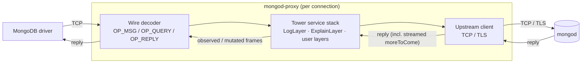

# mongod-proxy

A pluggable transparent proxy for the MongoDB wire protocol, written in Rust.

> ## ⚠️ Experimental
>
> **This crate is experimental and unstable.** It has not been audited, is not
> production-ready, and the public API may change at any time without notice.
> Wire-protocol coverage, error handling, and performance characteristics are
> still evolving. Do **not** rely on it for anything that matters (data
> integrity, security, uptime, billing, …). Use at your own risk.
>
> Bug reports, feedback, and PRs are very welcome — but please do not deploy
> this in front of a real database you care about.

## What it does

`mongod-proxy` accepts MongoDB driver connections, parses the wire-protocol
frames on each connection, optionally passes them through a stack of
[`tower`](https://crates.io/crates/tower) layers (for logging, inspection,
rate limiting, query-plan capture, …), and forwards them to a real `mongod`.

Both modern `OP_MSG` and legacy `OP_QUERY` / `OP_REPLY` frames are supported,
including:

- fire-and-forget writes (request flagged `moreToCome`)
- streaming-SDAM / exhaust cursors (multiple responses per request, each
  flagged `moreToCome` until a terminal reply)
- checksum-bearing `OP_MSG` frames

Two built-in layers ship with the crate:

- `LogLayer` — logs every parsed request and response via `tracing`.
- `ExplainLayer` — transparently re-issues every explainable command as
  `explain`, parses the plan tree, and forwards the typed `ExplainEvent` to a
  sink (channel, file, custom observer). See `examples/explain.rs`.

## Example

Accept driver connections on `:27018` and forward to a local `mongod` on
`:27017`, logging every frame:

```rust
use mongod_proxy::{LogLayer, Proxy, serve};
use tokio::net::TcpListener;

#[tokio::main]
async fn main() -> std::io::Result<()> {
    let listener = TcpListener::bind("127.0.0.1:27018").await?;

    // `Proxy` is a tower `Service<SocketAddr>` that produces a fresh
    // `Service<Message>` for every incoming client connection.
    let proxy = Proxy::new("127.0.0.1", 27017, /* use_tls = */ false)
        .layer(LogLayer); // log every parsed request and response

    serve(listener, proxy).await
}
```

Point any MongoDB driver at `mongodb://127.0.0.1:27018/?directConnection=true`
and traffic flows through the proxy unchanged, with every frame parsed and
logged.

A runnable example that captures executed query plans lives at
[`examples/explain.rs`](examples/explain.rs):

```bash
cargo run --example explain
```

## How it works



For each accepted client connection, the proxy:

1. **Decodes** the inbound byte stream into typed wire-protocol `Message`s
   (one type per OP code, in the [`operation`] module).
2. **Passes each `Message`** through the configured tower service stack. Layers
   can inspect, log, mutate, or short-circuit the request, and they see every
   response — including each frame of a streamed `moreToCome` exchange.
3. **Forwards** the resulting request to upstream `mongod` over TCP or TLS,
   and streams every reply back to the client.

Because the library is a `tower::Service<SocketAddr>` factory, you can compose
it with any `tower::Layer`, mix it with your own middleware, or embed it in a
larger application.

## Crate layout

- `mongod-proxy/` — the library crate.
- `logger/` — small standalone binary that proxies and logs (workspace
  member).
- `examples/explain.rs` — runnable explain-plan inspector.
- `tests/e2e_*.rs` — end-to-end tests that boot a real `mongod` in Docker
  via [`atlas-local`](https://crates.io/crates/atlas-local). They self-skip
  when Docker is unreachable.

## License

Licensed under either of

- Apache License, Version 2.0 ([LICENSE-APACHE](LICENSE-APACHE) or
  <http://www.apache.org/licenses/LICENSE-2.0>)
- MIT license ([LICENSE-MIT](LICENSE-MIT) or
  <http://opensource.org/licenses/MIT>)

at your option.

### Contribution

Unless you explicitly state otherwise, any contribution intentionally
submitted for inclusion in the work by you, as defined in the Apache-2.0
license, shall be dual licensed as above, without any additional terms or
conditions.
